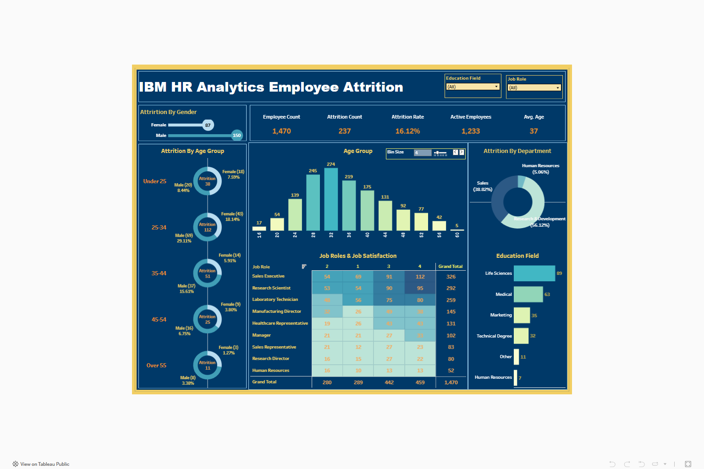

### 📊 HR Data Analytics Dashboard – Tableau Project

Welcome to the **HR Data Analytics Dashboard** built using **Tableau**.  
This project analyzes HR data to uncover key insights into **employee behavior, attrition patterns, and organizational trends** through interactive visualizations.

---

### 📌 Project Overview

In this project, HR data has been analyzed and visualized to help organizations:

- Understand **employee attrition and satisfaction levels**
- Track **job role distributions and gender ratios**
- Monitor **department-wise performance and engagement**
- Enable **data-driven HR decisions** to reduce turnover and improve employee satisfaction

---

### 📂 Dataset Details

**Source:** Kaggle HR Analytics Dataset  <a>https://www.kaggle.com/datasets/pavansubhasht/ibm-hr-analytics-attrition-dataset</a>  
**Format:** CSV  
**Dataset Size:** ~1,500 employee records  
**Key Fields:**

| Column | Description |
|------|-------------|
| Age | Age of employee |
| Attrition | Employee turnover status |
| Department | Department name |
| Job Role | Employee job position |
| Monthly Income | Employee salary |
| Job Satisfaction | Satisfaction rating |
| Years at Company | Employee tenure |
| Education Field | Educational background |

---

### 🛠 Tools & Technologies Used
- Visualization: Tableau
- Data Cleaning & Preparation: Microsoft Excel
- Documentation & Reporting: GitHub, PDF Reports, Markdown

---

### 📊 Dashboard Highlights

### Overall HR Statistics

| Metric | Value |
|------|------|
| Total Employees | 1,470 |
| Employees Who Left | 237 |
| Attrition Rate | 16.12% |
| Active Employees | 1,233 |
| Average Age | 37 |

---

### 📉 Department-Wise Attrition

| Department | Attrition Count | Percentage |
|-----------|---------------|------------|
| Research & Development | 133 | 56.12% |
| Sales | 92 | 38.82% |
| Human Resources | 12 | 5.06% |

**Insight:**  
Research & Development has the **highest attrition rate**, indicating the need for targeted retention strategies.

---

### 🎓 Education-Wise Attrition

| Education Level | Attrition Count |
|----------------|----------------|
| Bachelor's Degree | 99 |
| Master's Degree | 58 |
| Associate Degree | 44 |
| High School | 31 |
| Doctoral Degree | 5 |

**Insight:**  
Employees with **Bachelor’s degrees show the highest attrition**.

---

### 👥 Age & Gender Analysis

### Age Distribution
- Most employees fall between **28–36 years old**

### Highest Attrition Age Group
- **25–34 years** (112 employees)

### Gender-Based Attrition

| Gender | Attrition Count |
|------|------|
| Male | 150 |
| Female | 87 |

**Insight:**  
Early-career professionals show higher turnover.

---

### 😊 Job Satisfaction by Role

Roles with the **highest employee counts**:

| Job Role | Employee Count |
|---------|---------------|
| Sales Executive | 326 |
| Research Scientist | 292 |

Most employees report satisfaction levels **3 and 4**, indicating moderate to high satisfaction.

**Insight:**  
Roles with **high headcount and moderate satisfaction** may become future attrition risks.

---

### 📊 Tableau Dashboard

View the interactive dashboard here:

👉 **HR Attrition Dashboard**  
https://public.tableau.com/app/profile/anaghaparkhi/viz/HRAttritionAnalysis_17484747335300/HRDashboard

---

### 📁 Dashboard Preview

---

### 💡 Key Insights

• Employees aged **25–34 show the highest attrition rate**  
• Sales and technical roles experience **higher turnover**  
• Lower job satisfaction is associated with **higher attrition**  
• Research & Development has the **largest workforce and attrition share**

---

### 🚀 Skills Demonstrated

- Data Visualization
- HR Analytics
- Exploratory Data Analysis
- Dashboard Design
- Business Intelligence
- Data Storytelling

---

### 👤 Author

**Anagha Parkhi**

MS in Business Analytics  
Data Analyst | BI Developer

Tableau Public  
https://public.tableau.com/app/profile/anaghaparkhi

GitHub  
https://github.com/AnaghaParkhi
